# shortcaller
A Nextflow pipeline for short-read RNA-seq analysis, supporting differential expression, alternative splicing and circular RNA.

## Current Features
* **Quality Control & Trimming:** FastQC (https://www.bioinformatics.babraham.ac.uk/projects/fastqc/), multiqc (https://doi.org/10.1093/bioinformatics/btw354) and Fastp (https://doi.org/10.1093/bioinformatics/bty560).
* **Alignment:** STAR (https://doi.org/10.1093/bioinformatics/bts635).
* **Transcript Assembly & Quantification:** StringTie (https://doi.org/10.1038/nbt.3122) and FeatureCounts (https://doi.org/10.1093/bioinformatics/btt656).
* **Differential Expression Analysis:** DESeq2 (https://doi.org/10.1186/s13059-014-0550-8).
* **Alternative Splicing Analysis:** rMATS (https://doi.org/10.1073/pnas.1419161111) , sashimi plots (https://github.com/Xinglab/rmats2sashimiplot).
* **Downstream Analysis:** gffread (transcripts fasta, https://doi.org/10.12688/f1000research.23297.2), CPC2 (coding potential; https://doi.org/10.1093/nar/gkx428) and TransDecoder/rtracklayer (NMD prediciton; https://github.com/TransDecoder/TransDecoder, https://doi.org/10.1093/bioinformatics/btp328).
* **Visualization:** ComplexHeatmap (https://doi.org/10.1002/imt2.43), circlize (https://doi.org/10.1093/bioinformatics/btu393), ggplot2 (https://doi.org/10.1007/978-3-319-24277-4_9)
* **Circular RNA:** bwa (https://doi.org/10.1093/bioinformatics/btp324), CIRI2 (https://doi.org/10.1093/bib/bbx014).

  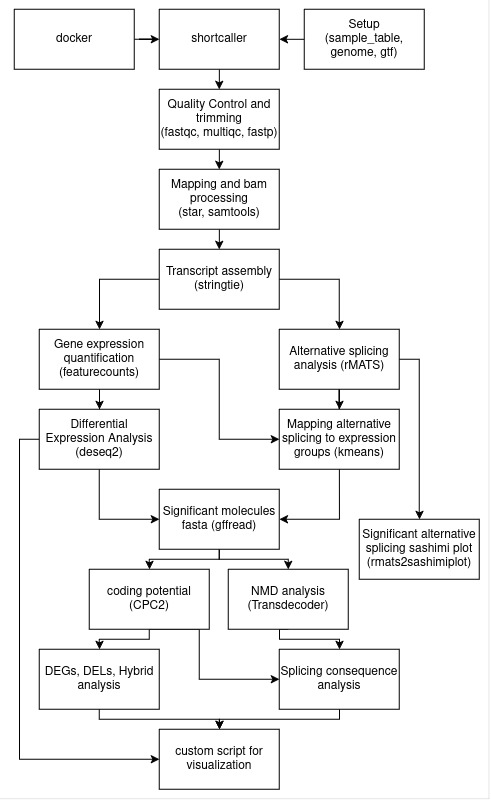

## Upcoming Features
* Single Nucleotide Variant (SNV) calling
* Alternative Polyadenylation (APA)

## Prerequisites & Environment
The pipeline relies on a pre-built Docker container containing all necessary dependencies:
**[mordziarz/pipeline_rnaseq on Docker Hub](https://hub.docker.com/r/mordziarz/pipeline_rnaseq)**

**Recommended Setup:**
1. Install **Nextflow** via Conda.
2. Ensure **Docker** is installed and running on your system.

## Input Data Format
Create a simple CSV file defining your samples, paths to paired-end reads, and experimental groups:

Note: quotation marks are not allowed in the table

```csv
sample,fastq_1,fastq_2,group
A_1,A1_1.test.fq.gz,A1_2.test.fq.gz,A
A_2,A2_1.test.fq.gz,A2_2.test.fq.gz,A
A_3,A3_1.test.fq.gz,A3_2.test.fq.gz,A
A_4,A4_1.test.fq.gz,A4_2.test.fq.gz,A
B_5,B1_1.test.fq.gz,B1_2.test.fq.gz,B
B_6,B2_1.test.fq.gz,B2_2.test.fq.gz,B
B_7,B3_1.test.fq.gz,B3_2.test.fq.gz,B
B_8,B4_1.test.fq.gz,B4_2.test.fq.gz,B
```
## Basic usage
```
nextflow run main.nf --sample_table samples_table.csv --fasta reference_genome.fasta --gtf reference_gtf.gtf -profile standard
```

## Parameters that can be defined

| Parameter | Default | Description |
| :--- | :--- | :--- |
| `sample_table` | `null` | Path to the samples CSV metadata table (Required). |
| `outdir` | `"results"` | Output directory for pipeline results. |
| `fasta` | `null` | Path to the reference genome FASTA file (Required). |
| `gtf` | `null` | Path to the reference annotation GTF file (Required). |
| `strand` | `"rf"` | Library strand-specificity (`rf` for reverse-stranded, `fr` for forward, etc.). |
| `trim_minlen` | `140` | Minimum length requirement for reads to pass filtering. |
| `trim_avgqual` | `20` | Minimum average quality score (Phred) required for reads. |
| `rmats_lib_type` | `"fr-firststrand"` | Library type parameter for rMATS. |
| `threads_fastqc` | `2` | CPU threads allocated to FastQC. |
| `threads_fastp` | `8` | CPU threads allocated to Fastp trimming. |
| `threads_star_index` | `8` | CPU threads allocated for building the STAR index. |
| `threads_star` | `8` | CPU threads allocated to STAR alignment. |
| `threads_stringtie` | `4` | CPU threads allocated to StringTie. |
| `threads_featurecounts` | `4` | CPU threads allocated to FeatureCounts. |
| `threads_rmats` | `8` | CPU threads allocated to rMATS. |

## Differentially Expressed Genes Analysis

The `results/differential_expression` directory contains the results and visualization plots from standard differential expression analysis, without distinguishing between coding and non-coding transcripts:

1. `Expression.csv` – A table containing all genes (both statistically significant and non-significant).

**Example:**

| GeneID | baseMean | log2FoldChange | lfcSE | pvalue | padj | LAND_2 | LAND_3 | LAND_4 | WATER_1 | WATER_2 | WATER_3 | WATER_4 |
| :--- | :--- | :--- | :--- | :--- | :--- | :--- | :--- | :--- | :--- | :--- | :--- | :--- |
| CL.1 | 5,31 | 0,0392 | 0,4354 | NA | NA | 0 | 0 | 0 | 37,17 | 0 | 0 | 0 |
| CL.10 | 263,40 | 0,0421 | 0,4237 | 0,6865 | 0,9019 | 368,18 | 217,44 | 0 | 407,35 | 43,10 | 640,96 | 166,77 |
| CL.1000 | 6,90 | 0,0396 | 0,4355 | NA | NA | 0 | 0 | 0 | 48,32 | 0 | 0 | 0 |
| CL.10000 | 6,37 | 0,0395 | 0,4355 | NA | NA | 0 | 0 | 0 | 44,60 | 0 | 0 | 0 |
| CL.10003 | 5,52 | 0,0393 | 0,4354 | NA | NA | 0 | 0 | 0 | 38,65 | 0 | 0 | 0 |
| CL.10004 | 5,71 | 0,0393 | 0,4354 | NA | NA | 0 | 0 | 0 | 0 | 0 | 0 | 39,97 |
| CL.10005 | 1752,88 | 0,4610 | 0,2630 | 0,0335 | 0,1737 | 1168,98 | 1841,86 | 1096,83 | 2567,53 | 2131,72 | 1976,07 | 1487,17 |
| CL.10006 | 830,27 | -0,1978 | 0,2414 | 0,3257 | 0,6799 | 972,62 | 913,62 | 873,56 | 703,21 | 732,68 | 968,44 | 647,79 |
| CL.10007 | 0,70 | 0,0333 | 0,4341 | 0,4957 | NA | 0 | 0 | 0 | 0,74 | 4,14 | 0 | 0 |

2. `Genes_sig.csv` – A table containing statistically significant genes filtered by absolute log2 fold change > 1 and padj < 0.05.

**Example:**

| GeneID | baseMean | log2FoldChange | lfcSE | pvalue | padj | LAND_2 | LAND_3 | LAND_4 | WATER_1 | WATER_2 | WATER_3 | WATER_4 | Expression | Transcripts |
| :--- | :--- | :--- | :--- | :--- | :--- | :--- | :--- | :--- | :--- | :--- | :--- | :--- | :--- | :--- |
| CL.10056 | 400,59 | -3,34 | 0,40 | 4,98e-18 | 8,57e-16 | 1129,10 | 670,60 | 695,81 | 72,85 | 72,94 | 103,56 | 59,27 | Downregulated | DEGs |
| CL.1007 | 1756,87 | -1,21 | 0,24 | 4,37e-08 | 1,93e-06 | 3012,97 | 2994,86 | 1933,54 | 1010,95 | 1132,17 | 1097,20 | 1116,41 | Downregulated | DEGs |
| CL.10171 | 277,20 | 1,19 | 0,59 | 0,0027 | 0,0295 | 171,82 | 174,50 | 47,69 | 270,58 | 445,90 | 464,63 | 365,24 | Upregulated | DEGs |
| CL.10202 | 2265,56 | -2,09 | 0,28 | 1,04e-14 | 1,23e-12 | 4718,89 | 3551,25 | 3939,70 | 1306,81 | 643,16 | 1069,21 | 629,88 | Downregulated | DEGs |
| CL.10348 | 22,63 | 7,46 | 3,24 | 5,99e-05 | 0,0013 | 0 | 0 | 0 | 37,17 | 45,58 | 34,99 | 40,66 | Upregulated | DEGs |
| CL.10553 | 2085,90 | 1,43 | 0,25 | 1,37e-09 | 7,85e-08 | 935,80 | 1134,72 | 984,11 | 2047,18 | 3016,90 | 2625,44 | 3857,12 | Upregulated | DEGs |

### Visualizations

* **PCA plot**:
  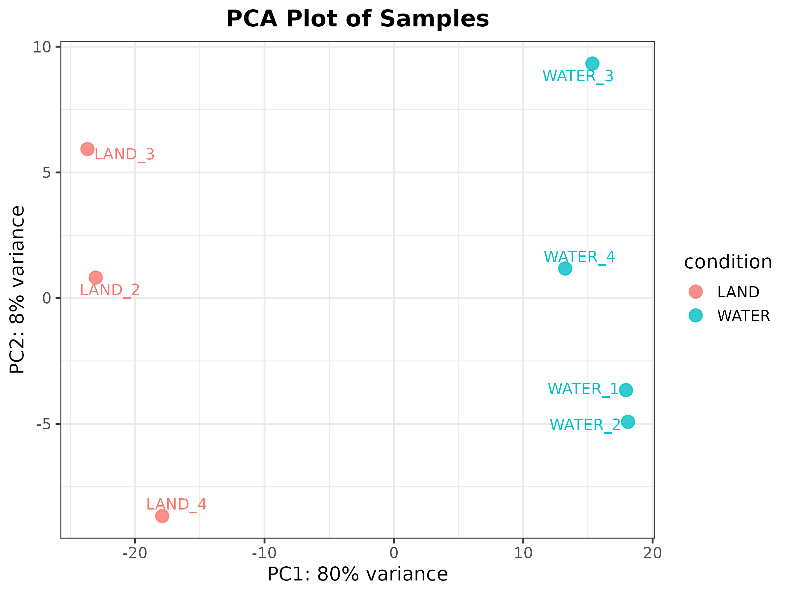

* **Volcano plot**:
  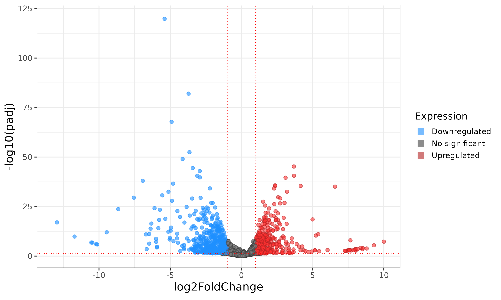

* **MA plot**:
  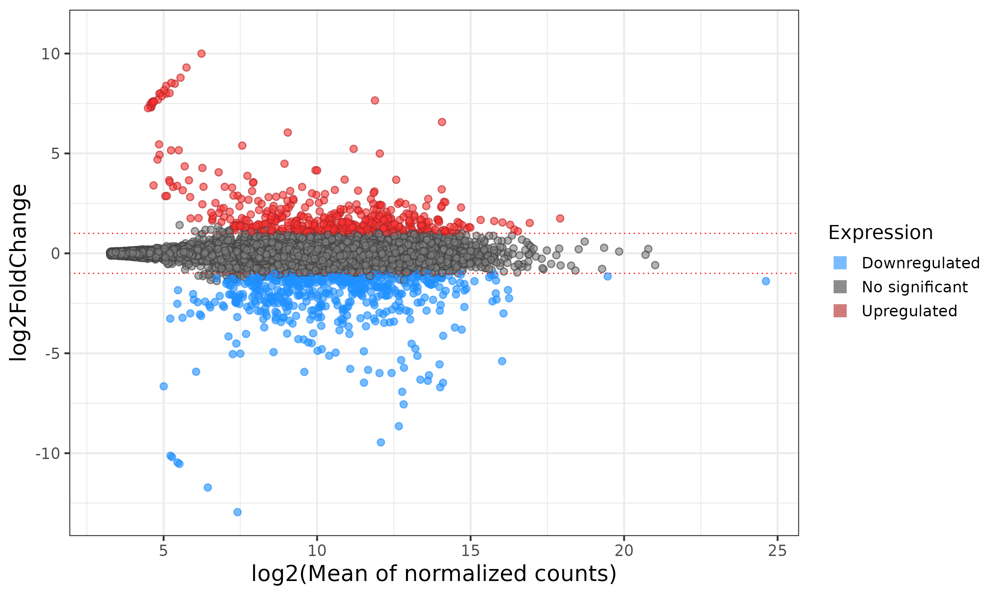

* **Heatmap** showing all DEGs:
  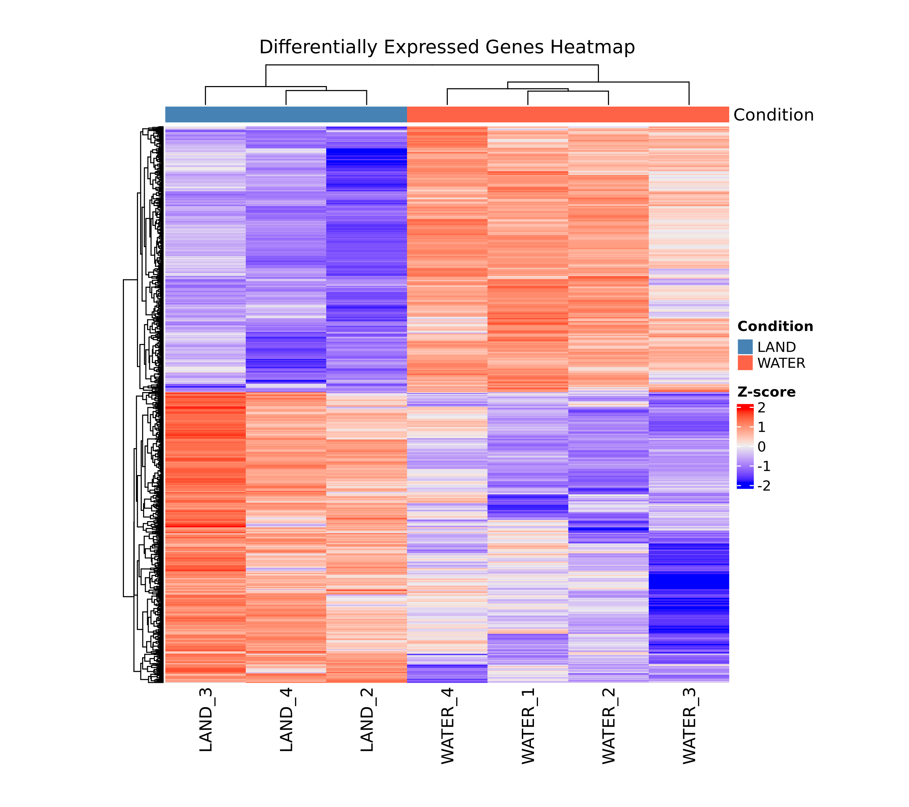
        
* **Heatmap** displaying the top 10 most significant DEGs:
  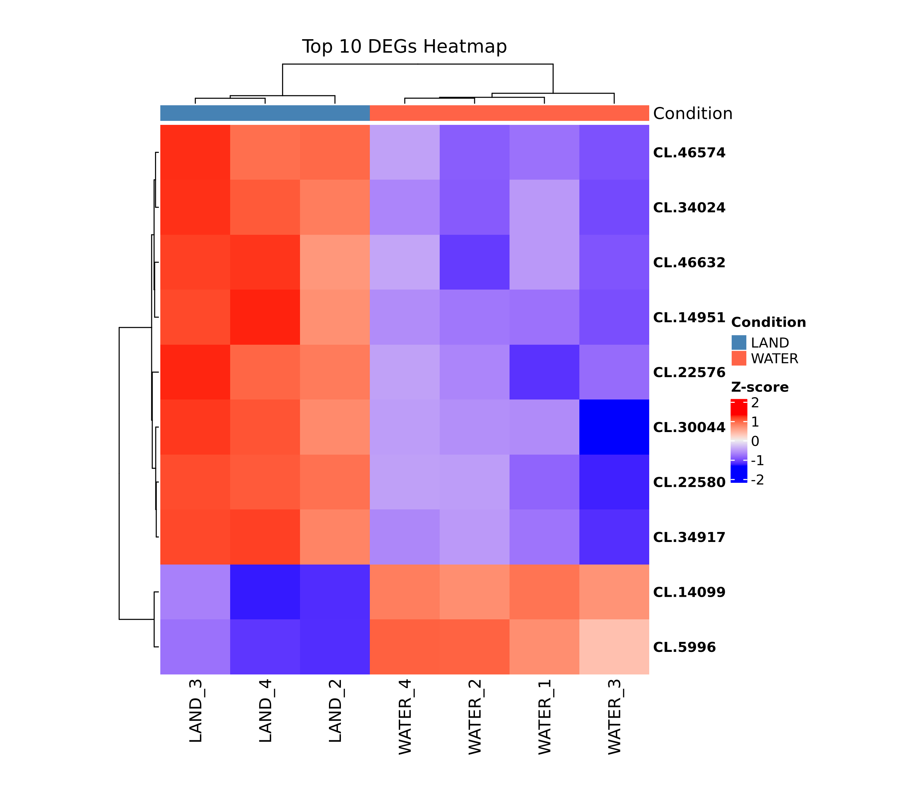
          
* **Circos plot** incorporating all DEGs:
  1. The outermost track features a heatmap.
  2. The inner dot plot track indicates up- or down-regulation.
  

* **Circos plot** restricted to the top 50 most significant DEGs:
  

## Differential Alternative Splicing Analysis

Results from the alternative splicing analysis are located across three directories: `results/splicing_plots_and_tables`, `results/sashimi_plots`, and `results/consequence_analysis`.

### Splicing Plots and Tables

In the `results/splicing_plots_and_tables` directory:

1. `All_splicing_events.csv` – Contains all alternative splicing events, both statistically significant and non-significant.

| GeneID | IncLevel1 | IncLevel2 | FDR | IncLevelDifference | ID | index | Type | OriginalType | Inclusion level | Significance |
| :--- | :--- | :--- | :--- | :--- | :--- | :--- | :--- | :--- | :--- | :--- |
| CL.47838 | 0.818,1.0,1.0 | 1.0,1.0,0.994,0.938 | 1 | 0,044 | 4 | CL.47838_7752_7777_7605_7638_8057_8194 | Not significant | SE | Not significant | Not Significant |
| CL.47796 | NA,NA,1.0 | NA,1.0,0.725,1.0 | 1 | -0,092 | 9 | CL.47796_40326_40424_38899_39034_41171_41337 | Not significant | SE | Not significant | Not Significant |
| CL.47765 | 0.95,1.0,1.0 | 1.0,1.0,0.922,1.0 | 1 | -0,003 | 10 | CL.47765_57220_57773_56603_56927_57895_58034 | Not significant | SE | Not significant | Not Significant |
| CL.47451 | 1.0,0.338,1.0 | 1.0,0.937,1.0,0.733 | 1 | 0,138 | 11 | CL.47451_52139242_52139413_52138709_52138716_52139682_52139879 | Not significant | SE | Not significant | Not Significant |
| CL.47451 | 1.0,0.485,1.0 | 1.0,0.959,1.0,0.726 | 1 | 0,093 | 12 | CL.47451_52139242_52139542_52138584_52138716_52139682_52140176 | Not significant | SE | Not significant | Not Significant |
| CL.47400 | 1.0,1.0,1.0 | 0.328,1.0,1.0,1.0 | 1 | -0,168 | 13 | CL.47400_51647477_51647547_51647091_51647164_51647733_51647802 | Not significant | SE | Not significant | Not Significant |

2. `Splicing_significant_results.csv` – Contains statistically significant splicing events filtered by absolute inclusion level difference > 0.1 and FDR < 0.05.

| GeneID | IncLevel1 | IncLevel2 | FDR | IncLevelDifference | ID | index | Type | OriginalType | Inclusion level | Significance | LAND_1 | LAND_2 | LAND_3 | WATER_1 | WATER_2 | WATER_3 | WATER_4 |
| :--- | :--- | :--- | :--- | :--- | :--- | :--- | :--- | :--- | :--- | :--- | :--- | :--- | :--- | :--- | :--- | :--- | :--- |
| CL.47260 | 0.94,0.761,0.763 | 0.254,0.457,0.256,0.524 | 5,64e-08 | -0,449 | 24 | CL.47260_50331332_50331424_50330435_50331185_50331550_50331923 | SE | SE | Lower | Significant | 0.94 | 0.761 | 0.763 | 0.254 | 0.457 | 0.256 | 0.524 |
| CL.46180 | 0.755,0.754,0.873 | 1.0,1.0,1.0,1.0 | 3,87e-08 | 0,206 | 73 | CL.46180_39507146_39507207_39506870_39506939_39507455_39507595 | SE | SE | Higher | Significant | 0.755 | 0.754 | 0.873 | 1.0 | 1.0 | 1.0 | 1.0 |
| CL.45381 | 0.542,0.258,0.691 | 0.929,1.0,1.0,0.341 | 0,0176 | 0,321 | 127 | CL.45381_32257917_32258365_32257104_32257298_32258519_32258632 | SE | SE | Higher | Significant | 0.542 | 0.258 | 0.691 | 0.929 | 1.0 | 1.0 | 0.341 |
| CL.44377 | 1.0,1.0,1.0 | 0.55,0.922,1.0,0.712 | 0,0170 | -0,204 | 175 | CL.44377_22753504_22753681_22753272_22753380_22753801_22754019 | SE | SE | Lower | Significant | 1.0 | 1.0 | 1.0 | 0.55 | 0.922 | 1.0 | 0.712 |
| CL.43158 | 0.347,0.183,0.187 | 0.59,0.645,0.555,0.428 | 5,59e-06 | 0,316 | 230 | CL.43158_11213091_11213161_11212755_11212840_11214079_11214353 | SE | SE | Higher | Significant | 0.347 | 0.183 | 0.187 | 0.59 | 0.645 | 0.555 | 0.428 |
| CL.42984 | 0.14,0.281,0.409 | 0.443,0.435,1.0,0.564 | 0,0444 | 0,334 | 237 | CL.42984_9600472_9600665_9598942_9599072_9601997_9602982 | SE | SE | Higher | Significant | 0.14 | 0.281 | 0.409 | 0.443 | 0.435 | 1.0 | 0.564 |
| CL.42948 | 1.0,0.379,0.673 | 0.0,0.56,0.166,0.201 | 0,0028 | -0,452 | 239 | CL.42948_9292647_9292888_9291371_9292063_9293173_9293486 | SE | SE | Lower | Significant | 1.0 | 0.379 | 0.673 | 0.0 | 0.56 | 0.166 | 0.201 |
| CL.20232 | 0.08,0.0,0.0 | 0.264,0.082,0.258,0.371 | 0,0007 | 0,217 | 291 | CL.20232_43759625_43759722_43757519_43759435_43759937_43760706 | SE | SE | Higher | Significant | 0.08 | 0.0 | 0.0 | 0.264 | 0.082 | 0.258 | 0.371 |
| CL.2837 | 1.0,1.0,1.0 | 0.321,0.592,1.0,0.763 | 0,0013 | -0,331 | 292 | CL.2837_25447734_25448003_25447305_25447388_25448518_25448888 | SE | SE | Lower | Significant | 1.0 | 1.0 | 1.0 | 0.321 | 0.592 | 1.0 | 0.763 |

3. Tables for significant processes categorized by event type individually (e.g., `SE_sashimi.txt` for skipped exon events):

| ID | GeneID | geneSymbol | chr | strand | exonStart_0base | exonEnd | upstreamES | upstreamEE | downstreamES | downstreamEE | ID.1 | IJC_SAMPLE_1 | SJC_SAMPLE_1 | IJC_SAMPLE_2 | SJC_SAMPLE_2 | IncFormLen | SkipFormLen | PValue | FDR | IncLevel1 | IncLevel2 | IncLevelDifference |
| :--- | :--- | :--- | :--- | :--- | :--- | :--- | :--- | :--- | :--- | :--- | :--- | :--- | :--- | :--- | :--- | :--- | :--- | :--- | :--- | :--- | :--- | :--- |
| 24 | CL.47260 | NA | chr8 | - | 50331332 | 50331424 | 50330435 | 50331185 | 50331550 | 50331923 | 24 | 155,106,219 | 6,20,41 | 152,84,20,119 | 269,60,35,65 | 231 | 139 | 8,98e-11 | 5,64e-08 | 0.94,0.761,0.763 | 0.254,0.457,0.256,0.524 | -0,449 |
| 73 | CL.46180 | NA | chr8 | + | 39507146 | 39507207 | 39506870 | 39506939 | 39507455 | 39507595 | 73 | 80,88,217 | 18,20,22 | 262,305,198,254 | 0,0,0,0 | 200 | 139 | 2,68e-11 | 3,87e-08 | 0.755,0.754,0.873 | 1.0,1.0,1.0,1.0 | 0,206 |
| 127 | CL.45381 | NA | chr8 | + | 32257917 | 32258365 | 32257104 | 32257298 | 32258519 | 32258632 | 127 | 135,91,170 | 27,62,18 | 659,201,166,70 | 12,0,0,32 | 587 | 139 | 0,000281 | 0,0176 | 0.542,0.258,0.691 | 0.929,1.0,1.0,0.341 | 0,321 |
| 175 | CL.44377 | NA | chr8 | + | 22753504 | 22753681 | 22753272 | 22753380 | 22753801 | 22754019 | 175 | 73,114,80 | 0,0,0 | 86,135,53,146 | 31,5,0,26 | 316 | 139 | 0,000259 | 0,0170 | 1.0,1.0,1.0 | 0.55,0.922,1.0,0.712 | -0,204 |
| 230 | CL.43158 | NA | chr8 | + | 11213091 | 11213161 | 11212755 | 11212840 | 11214079 | 11214353 | 230 | 4,34,40 | 5,101,116 | 188,101,30,126 | 87,37,16,112 | 209 | 139 | 2,33e-08 | 5,59e-06 | 0.347,0.183,0.187 | 0.59,0.645,0.555,0.428 | 0,316 |
| 237 | CL.42984 | NA | chr8 | - | 9600472 | 9600665 | 9598942 | 9599072 | 9601997 | 9602982 | 237 | 14,95,48 | 36,102,29 | 93,112,151,198 | 49,61,0,64 | 332 | 139 | 0,001018 | 0,0444 | 0.14,0.281,0.409 | 0.443,0.435,1.0,0.564 | 0,334 |
| 239 | CL.42948 | NA | chr8 | + | 9292647 | 9292888 | 9291371 | 9292063 | 9293173 | 9293486 | 239 | 59,20,62 | 0,12,11 | 0,115,24,46 | 183,33,44,67 | 380 | 139 | 2,69e-05 | 0,0028 | 1.0,0.379,0.673 | 0.0,0.56,0.166,0.201 | -0,452 |
| 291 | CL.20232 | NA | chr3 | - | 43759625 | 43759722 | 43757519 | 43759435 | 43759937 | 43760706 | 291 | 10,0,0 | 68,34,33 | 53,18,23,71 | 87,118,39,71 | 236 | 139 | 4,32e-06 | 0,0007 | 0.08,0.0,0.0 | 0.264,0.082,0.258,0.371 | 0,217 |
| 292 | CL.2837 | NA | chr1 | - | 25447734 | 25448003 | 25447305 | 25447388 | 25448518 | 25448888 | 292 | 32,59,86 | 0,0,0 | 25,81,15,85 | 18,19,0,9 | 408 | 139 | 8,84e-06 | 0,0013 | 1.0,1.0,1.0 | 0.321,0.592,1.0,0.763 | -0,331 |
| 495 | CL.18376 | NA | chr3 | - | 27333020 | 27333124 | 27332699 | 27332779 | 27333288 | 27333366 | 495 | 3,51,31 | 55,75,53 | 135,107,48,92 | 85,80,37,22 | 243 | 139 | 2,25e-05 | 0,0025 | 0.03,0.28,0.251 | 0.476,0.433,0.426,0.705 | 0,323 |

### Visualizations

* **Barplot** showing both significant and non-significant splicing events:
  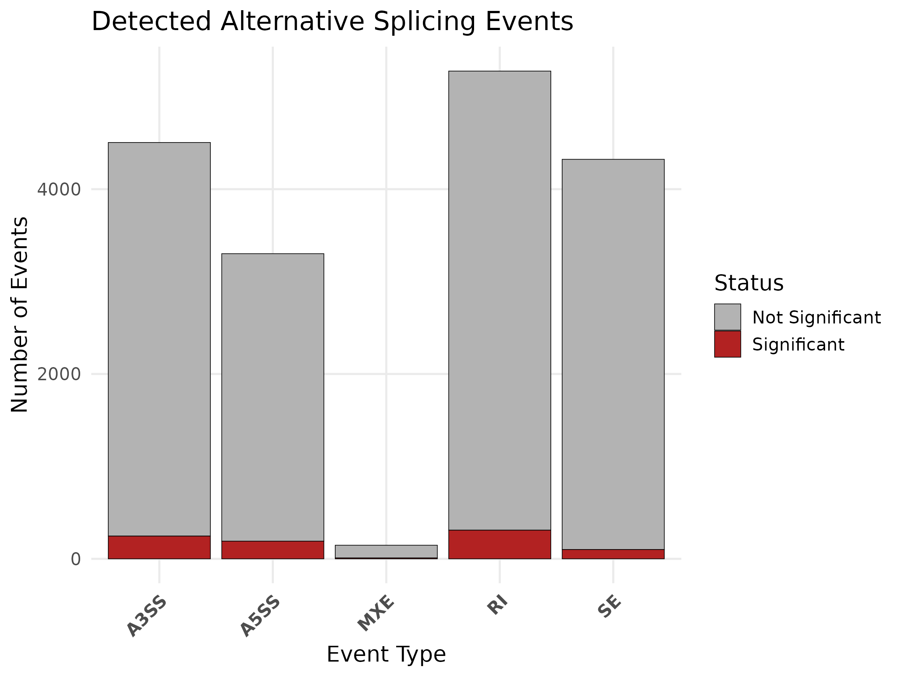

* **Barplot** showing splicing events:
  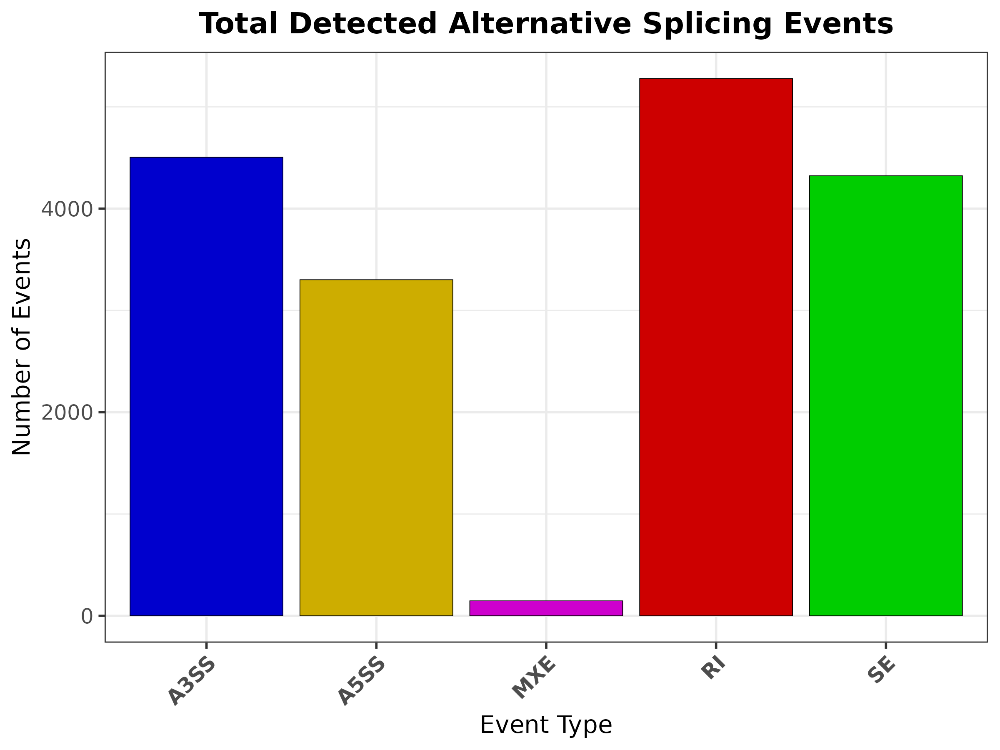

* **Volcano plot** of splicing events:
  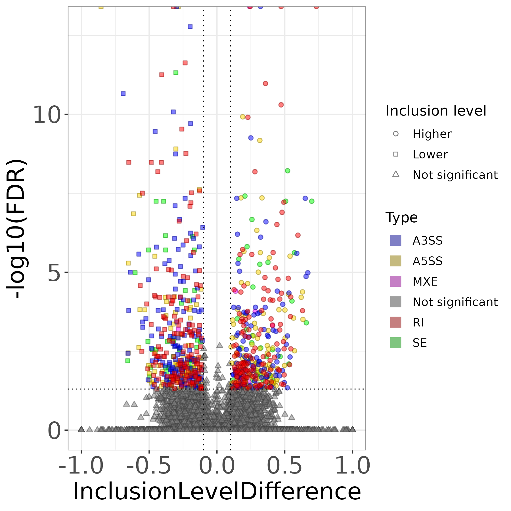

* **Circos plot** combining:
  1. Five heatmaps, each color representing a different alternative splicing event.
  2. A dot plot showing whether a given event is higher or lower based on the inclusion level difference.
  3. Internal links connecting common alternative splicing events within the same gene.
  

---

### Sashimi Plots

In the `results/sashimi_plots` directory, you will find Sashimi plots for every significant alternative splicing event. Navigate into `sashimi_plots`, select the specific event type directory (e.g., `sashimi_RI_output`), and open the `Sashimi_plot` folder to find the corresponding PDF visualizations:

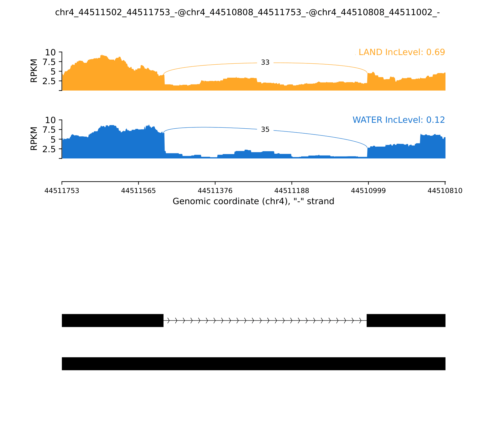

---

### Consequence Analysis

The `results/consequence_analysis` directory contains:

* `consequence_matrix.csv` – A table detailing the counts of protein-coding isoforms, NMD isoforms, significant events, and non-significant alternative splicing events in genes containing statistically significant splicing:

| gene_id | Total_Isoforms | Protein_Coding | Non_Coding | NMD_Isoforms | Sig_RI | Sig_SE | Sig_A5SS | Sig_A3SS | Sig_MXE | All_A3SS | All_A5SS | All_RI | All_SE | All_MXE | total_splicing_events | NoSig_RI | NoSig_SE | NoSig_A5SS | NoSig_A3SS | NoSig_MXE |
| :--- | :--- | :--- | :--- | :--- | :--- | :--- | :--- | :--- | :--- | :--- | :--- | :--- | :--- | :--- | :--- | :--- | :--- | :--- | :--- | :--- |
| CL.10018 | 12 | 3 | 9 | 10 | 1 | 1 | 0 | 0 | 0 | 0 | 2 | 7 | 1 | 0 | 10 | 6 | 0 | 2 | 0 | 0 |
| CL.10067 | 11 | 2 | 9 | 10 | 0 | 0 | 1 | 0 | 0 | 2 | 6 | 0 | 4 | 3 | 15 | 0 | 4 | 5 | 2 | 3 |
| CL.10096 | 3 | 3 | 0 | 3 | 1 | 0 | 0 | 0 | 0 | 0 | 1 | 2 | 0 | 0 | 3 | 1 | 0 | 1 | 0 | 0 |
| CL.10104 | 5 | 5 | 0 | 5 | 1 | 1 | 1 | 0 | 0 | 0 | 3 | 4 | 1 | 0 | 8 | 3 | 0 | 2 | 0 | 0 |
| CL.10192 | 4 | 4 | 0 | 2 | 0 | 0 | 0 | 1 | 0 | 2 | 0 | 0 | 0 | 0 | 2 | 0 | 0 | 0 | 1 | 0 |
| CL.10252 | 8 | 8 | 0 | 6 | 0 | 0 | 1 | 0 | 0 | 1 | 2 | 2 | 1 | 0 | 6 | 2 | 1 | 1 | 1 | 0 |
| CL.10354 | 5 | 4 | 1 | 4 | 0 | 0 | 0 | 1 | 0 | 4 | 1 | 1 | 5 | 0 | 11 | 1 | 5 | 1 | 3 | 0 |
| CL.10564 | 6 | 6 | 0 | 6 | 0 | 0 | 1 | 0 | 0 | 1 | 2 | 3 | 0 | 0 | 6 | 3 | 0 | 1 | 1 | 0 |
| CL.10584 | 4 | 4 | 0 | 2 | 1 | 0 | 1 | 0 | 0 | 0 | 1 | 2 | 0 | 0 | 3 | 1 | 0 | 0 | 0 | 0 |
| CL.10751 | 3 | 1 | 2 | 2 | 0 | 0 | 1 | 0 | 0 | 0 | 1 | 1 | 0 | 0 | 2 | 1 | 0 | 0 | 0 | 0 |
| CL.10934 | 9 | 1 | 8 | 8 | 1 | 0 | 0 | 0 | 0 | 0 | 3 | 5 | 3 | 0 | 11 | 4 | 3 | 3 | 0 | 0 |
| CL.11036 | 9 | 8 | 1 | 5 | 0 | 1 | 0 | 0 | 0 | 2 | 1 | 2 | 4 | 0 | 9 | 2 | 3 | 1 | 2 | 0 |
| CL.11059 | 4 | 4 | 0 | 1 | 0 | 0 | 0 | 1 | 0 | 2 | 0 | 0 | 0 | 0 | 2 | 0 | 0 | 0 | 1 | 0 |

### Visualization

* **Combined plot** featuring a heatmap alongside barplots representing NMD and protein-coding transcripts for each significant gene containing at least one statistically significant alternative splicing event:
  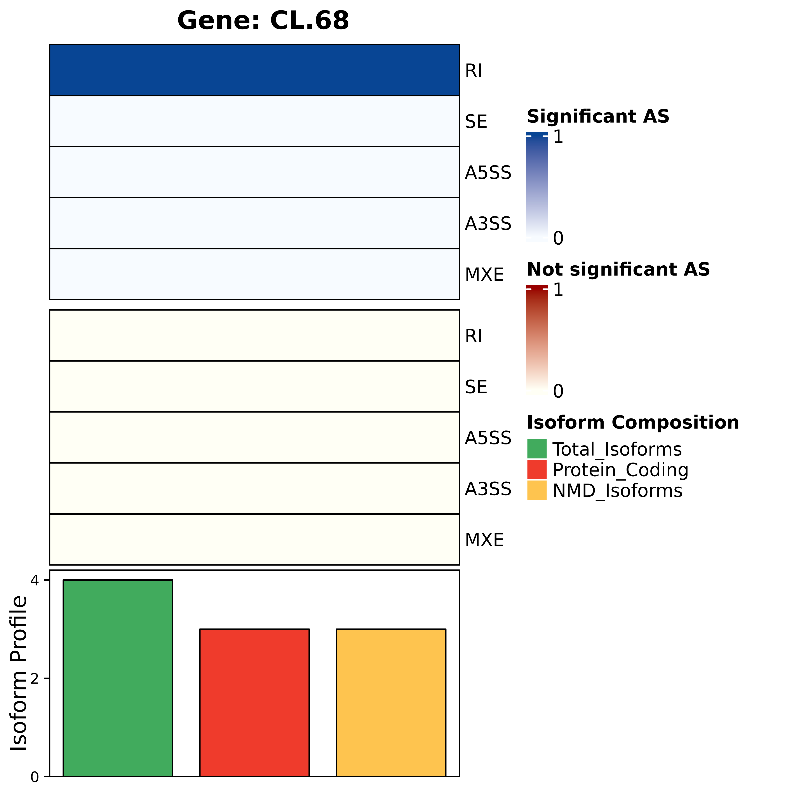

## Differentially Expressed Genes Analysis (DEGs, DELs, Hybrid)

The `results/DEGs_DELs_Hybrid` directory contains visualization plots and two primary tables:

1. `Genes_sig_with_coding_potential.csv` – A table containing DESeq2 statistical significance results along with functional classifications distinguishing whether a gene is classified as a DEL, DEG, or Hybrid (i.e., genes where not all transcripts possess coding potential).

**Example:**

| GeneID | baseMean | log2FoldChange | lfcSE | pvalue | padj | LAND_2 | LAND_3 | LAND_4 | WATER_1 | WATER_2 | WATER_3 | WATER_4 | Expression | Total_Isoforms | Protein_Coding_Isoforms | Non_Coding_Isoforms | Transcripts |
| :--- | :--- | :--- | :--- | :--- | :--- | :--- | :--- | :--- | :--- | :--- | :--- | :--- | :--- | :--- | :--- | :--- | :--- |
| CL.10056 | 400,59 | -3,34 | 0,40 | 4,98e-18 | 8,57e-16 | 1129,10 | 670,60 | 695,81 | 72,85 | 72,94 | 103,56 | 59,27 | Downregulated | 4 | 3 | 1 | Hybrid |
| CL.1007 | 1756,87 | -1,21 | 0,24 | 4,37e-08 | 1,93e-06 | 3012,97 | 2994,86 | 1933,54 | 1010,95 | 1132,17 | 1097,20 | 1116,41 | Downregulated | 6 | 5 | 1 | Hybrid |
| CL.10171 | 277,20 | 1,19 | 0,59 | 0,0027 | 0,0295 | 171,82 | 174,50 | 47,69 | 270,58 | 445,90 | 464,63 | 365,24 | Upregulated | 3 | 1 | 2 | Hybrid |
| CL.10202 | 2265,56 | -2,09 | 0,28 | 1,04e-14 | 1,23e-12 | 4718,89 | 3551,25 | 3939,70 | 1306,81 | 643,16 | 1069,21 | 629,88 | Downregulated | 4 | 2 | 2 | Hybrid |
| CL.10348 | 22,63 | 7,46 | 3,24 | 5,99e-05 | 0,0013 | 0 | 0 | 0 | 37,17 | 45,58 | 34,99 | 40,66 | Upregulated | 1 | 0 | 1 | DELs |
| CL.10553 | 2085,90 | 1,43 | 0,25 | 1,37e-09 | 7,85e-08 | 935,80 | 1134,72 | 984,11 | 2047,18 | 3016,90 | 2625,44 | 3857,12 | Upregulated | 2 | 2 | 0 | DEGs |
| CL.10555 | 50,50 | 4,36 | 1,39 | 5,23e-05 | 0,0012 | 0 | 7,31 | 0 | 83,26 | 130,95 | 69,97 | 62,02 | Upregulated | 1 | 0 | 1 | DELs |

2. `per_gene_pairwise_categories_correlation.csv` – A table showing pairwise expression profile correlations across categories (DEGs vs. DELs, DEGs vs. Hybrid, and DELs vs. Hybrid). It includes gene IDs, their respective categories, correlation values, raw p-values, and FDR-adjusted p-values.

**Example:**
| GeneID1 | GeneID2 | Correlation | P_Value | Category1 | Category2 | FDR |
| :--- | :--- | :--- | :--- | :--- | :--- | :--- |
| CL.10553 | CL.10348 | 0,9038 | 0,0052 | DEGs | DELs | 0,0286 |
| CL.10553 | CL.10555 | 0,7607 | 0,0471 | DEGs | DELs | 0,0822 |
| CL.10553 | CL.10795 | -0,6383 | 0,1229 | DEGs | DELs | 0,1534 |
| CL.10553 | CL.10801 | -0,6585 | 0,1078 | DEGs | DELs | 0,1396 |
| CL.10553 | CL.10802 | -0,9140 | 0,0040 | DEGs | DELs | 0,0257 |
| CL.10553 | CL.10895 | -0,6554 | 0,1100 | DEGs | DELs | 0,1417 |
| CL.10553 | CL.10965 | 0,7039 | 0,0775 | DEGs | DELs | 0,1117 |
| CL.10553 | CL.11114 | -0,8336 | 0,0198 | DEGs | DELs | 0,0516 |
| CL.10553 | CL.11337 | 0,8577 | 0,0136 | DEGs | DELs | 0,0430 |
| CL.10553 | CL.11702 | 0,5394 | 0,2115 | DEGs | DELs | 0,2344 |
| CL.10553 | CL.12460 | 0,9900 | 1,91e-05 | DEGs | DELs | 0,0063 |
| CL.10553 | CL.12757 | -0,7110 | 0,0733 | DEGs | DELs | 0,1078 |
| CL.10553 | CL.12834 | 0,8304 | 0,0207 | DEGs | DELs | 0,0527 |
| CL.10553 | CL.12940 | 0,2234 | 0,6301 | DEGs | DELs | 0,6347 |
| CL.10553 | CL.12984 | -0,7387 | 0,0579 | DEGs | DELs | 0,0930 |
| CL.10553 | CL.12989 | 0,6493 | 0,1145 | DEGs | DELs | 0,1458 |

### Visualizations

* **Volcano plot** highlighting DEGs, DELs, Hybrid, as well as up- and down-regulated genes:
  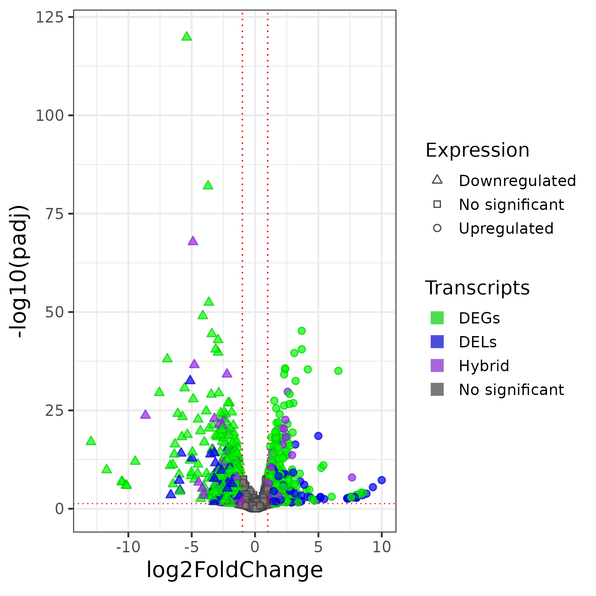

* **MA plot** highlighting DEGs, DELs, Hybrid, as well as up- and down-regulated genes:
  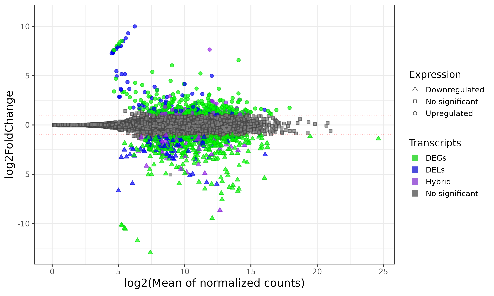

* **Example heatmap** showing DEGs (outputs for DELs and Hybrid are also generated):
  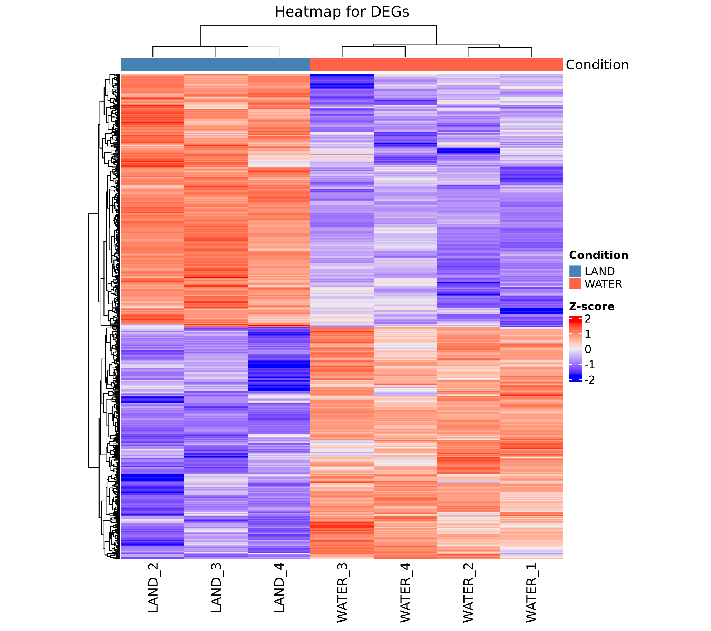

* **Example heatmap** displaying the top 10 most significant DEGs (outputs for DELs and Hybrid are also generated):
  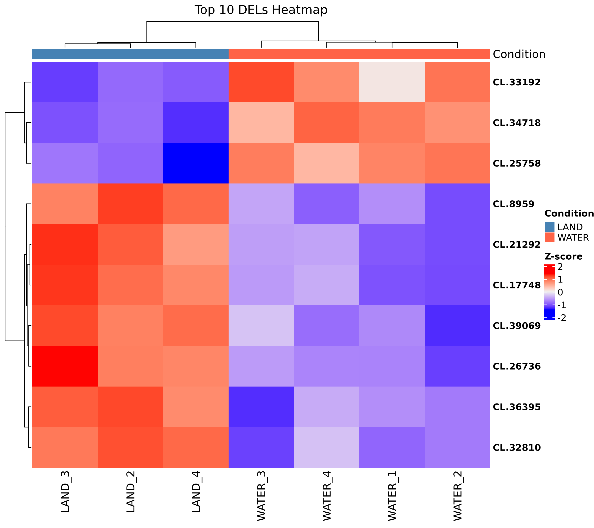

* **Circos plot** integrating the results from this analysis step:
  1. The 3 outermost heatmap tracks corresponding to DEGs, DELs, and Hybrid.
  2. A dot plot track indicating whether a given molecule is up- or down-regulated.
  3. Internal links connecting molecules with correlated expression profiles (default: FDR < 0.05 and r > 0.99).
  

## K-means Gene Expression Analysis

The `results/kmeans_results` directory contains the outputs for this section. I decided to implement expression categorization into "Low", "Medium", and "High" groups to determine what percentage of alternative splicing events fall into each expression tier, since standard differential expression analysis does not always provide a complete picture regarding the spliceosome context. K-means clustering was applied so the algorithm could objectively determine the boundaries between these groups.

1. `expression_classification.csv` – A table containing each gene categorized based on its Mean TPM in Group 1 (G1) and Group 2 (G2).

**Example:**
| Geneid | Length | Mean_TPM_G1 | Mean_TPM_G2 | Class_G1 | Class_G2 |
| :--- | :--- | :--- | :--- | :--- | :--- |
| CL.1 | 205 | 0 | 0,94986 | No Expression | Low |
| CL.2 | 269 | 0 | 0,57633 | No Expression | Low |
| CL.3 | 193 | 0,07133 | 0,18681 | Low | Low |
| CL.4 | 201 | 0 | 1,20127 | No Expression | Low |
| CL.5 | 272 | 0,32069 | 0,28395 | Low | Low |
| CL.6 | 1810 | 1,67597 | 2,04150 | Low | Low |
| CL.7 | 204 | 0 | 0 | No Expression | No Expression |
| CL.8 | 360 | 0 | 0 | No Expression | No Expression |
| CL.9 | 612 | 4,41022 | 8,68292 | Medium | Medium |
| CL.10 | 2029 | 1,79266 | 3,38957 | Low | Low |
| CL.11 | 6267 | 39,54369 | 43,91635 | High | High |
| CL.12 | 260 | 0 | 0,60178 | No Expression | Low |
| CL.13 | 3360 | 17,10951 | 22,68621 | Medium | Medium |
| CL.14 | 238 | 0 | 0 | No Expression | No Expression |

### Visualizations

* **Example scatter plot** showing clustering relative to Group 1 (G1):
  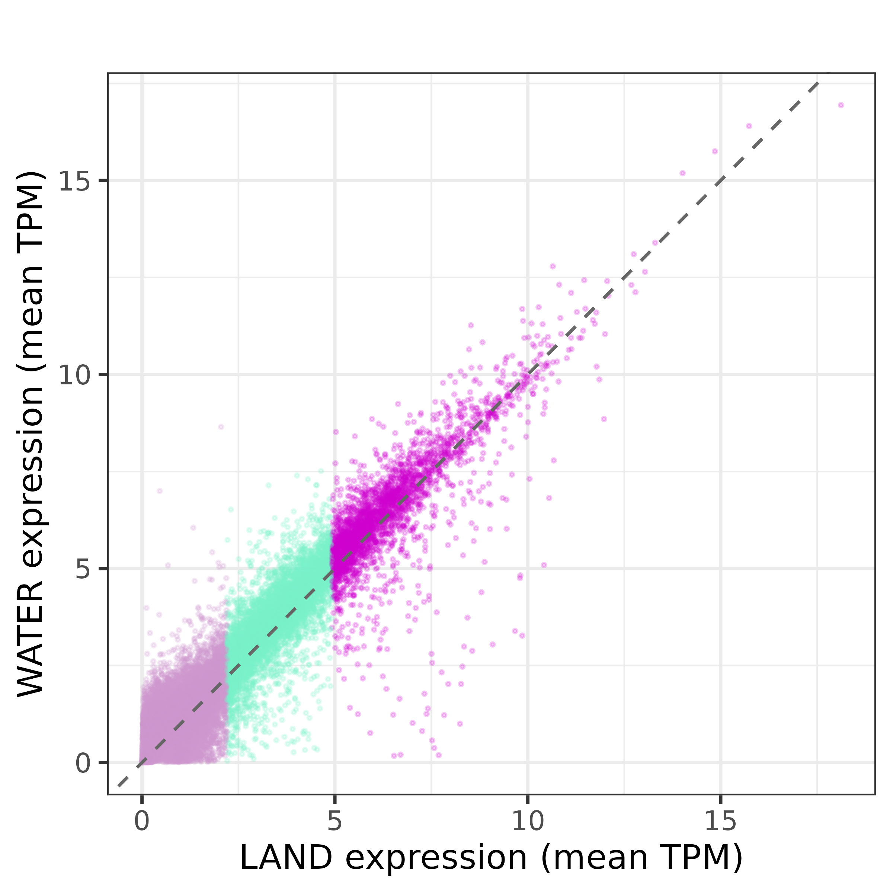

* **Example scatter plot** showing clustering relative to Group 2 (G2):
  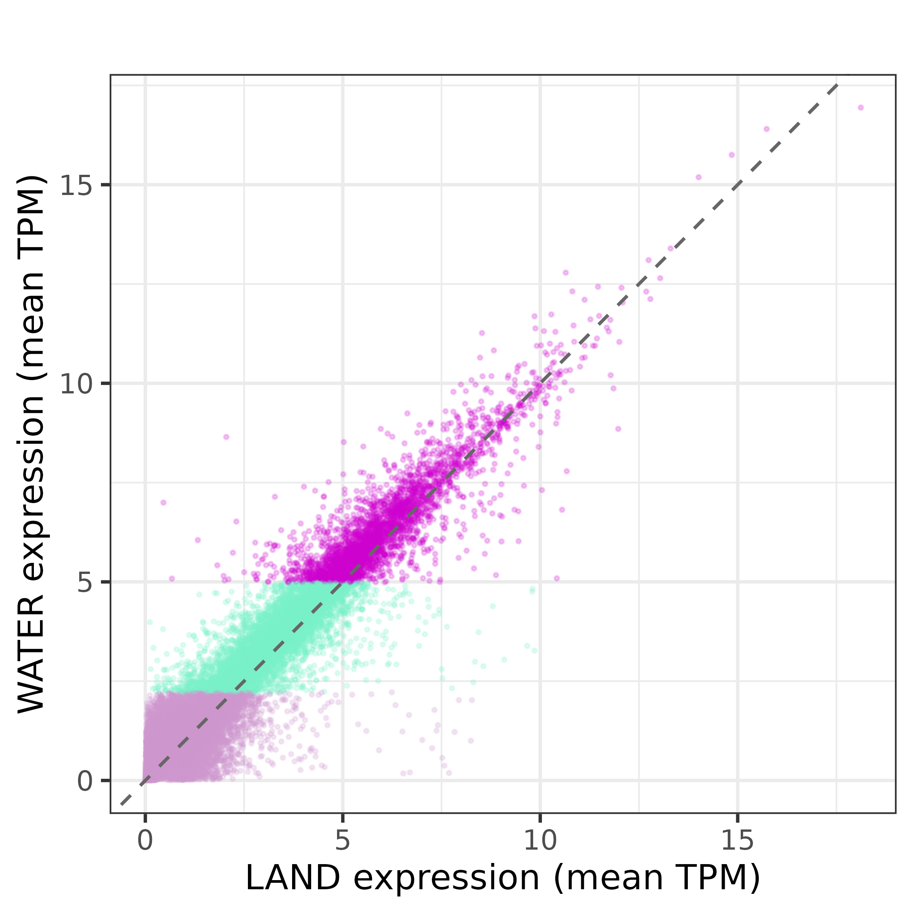

* **Example scatter plot** combined plot of both groups:
  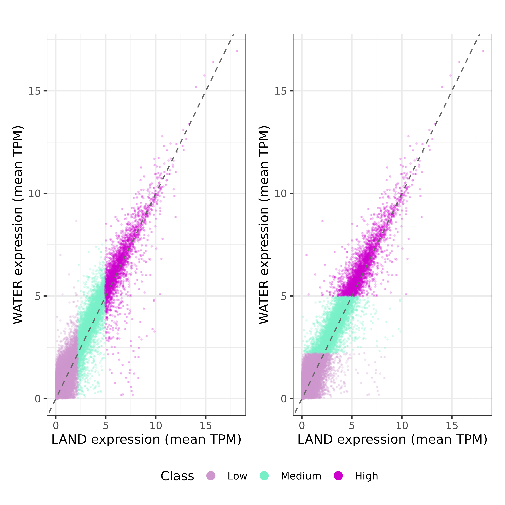

* **Example barplot  plot** association between expression groups and significant alternative splicing events:
  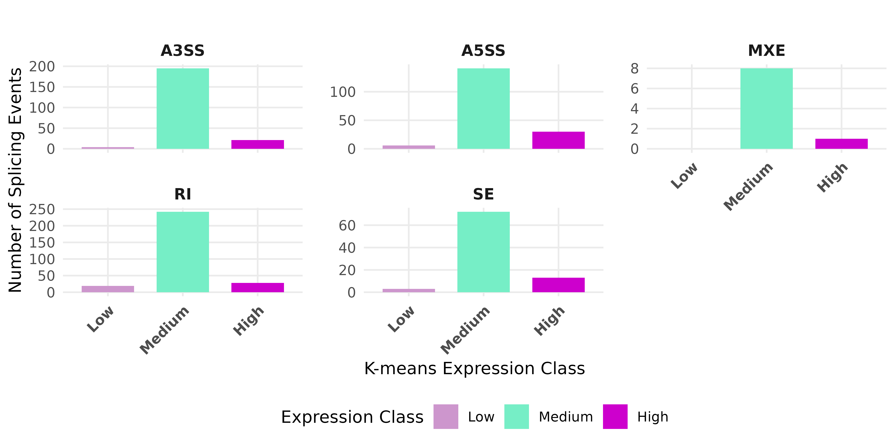

## Single Nucleotide Variants

The results/snv_plots_and_tables directory contains generated tables and summary plots for Single Nucleotide Variants (SNVs).

### Column Descriptions

| Column Name | Category | Description |
| :--- | :--- | :--- |
| `CHROM`, `POS`, `REF`, `ALT` | Variant Info | Chromosome, genomic position, reference allele, and alternative allele. |
| `Ann_Allele` | Variant Info | Annotated alternative allele. |
| `p_value` | Statistics | P-value derived from the Chi-square test evaluating group differences. |
| `p_adj` | Statistics | Adjusted p-value using the Benjamini-Hochberg (FDR) method. |
| `AltAllelleFracDifference` | Statistics | Direction of alternative allele frequency change (`Higher`, `Lower`, or `Not significant`). |
| `Significance` | Statistics | Statistical significance status (`Significant` or `Not Significant`). |
| `Effect`, `Impact`, `Feature_Type` | Functional Annotation | Biological effect category (SnpEff), predicted impact, and genomic feature type. |
| `Gene_Name`, `Gene_ID` | Functional Annotation | Gene name and unique gene identifier. |
| `transcript_id`, `BioType`, `Rank` | Functional Annotation | Transcript identifier, biological type, and exon/intron rank. |
| `HGVS_c`, `HGVS_p` | Functional Annotation | Coding DNA sequence change (`c.`) and protein level change (`p.`). |
| `GT_[sample]` | Raw Metrics | Sample genotype (e.g., `0/1`, `1/1`). |
| `DP_[sample]` | Raw Metrics | Total read depth for the specified sample. |
| `RO_[sample]` | Raw Metrics | Reference observation count (reads supporting the reference allele). |
| `AO_[sample]` | Raw Metrics | Alternative observation count (reads supporting the alternative allele). |
| `RF_[sample]` | Frequencies | Reference allele frequency ($RO / DP$). |
| `AF_[sample]` | Frequencies | Alternative allele frequency ($AO / DP$). |
| `delta_AF`, `delta_RF` | Frequencies | Difference in mean allele frequencies between groups (Group 2 - Group 1). |
| `Simple_Effect` | Visualization | Simplified functional effect category (e.g., `Missense`, `3' UTR`, `5' UTR`, `Synonymous`, `Other`). |
| `Plot_Effect` | Visualization | Category incorporating statistical significance for volcano plots. |

---
### Data Tables

1. All_snv.csv
Complete dataset of all detected SNV variants with calculated statistics and metrics across all samples:

| CHROM | POS | REF | ALT | p_value | p_adj | Effect | Gene_Name | HGVS_c | HGVS_p | delta_AF | Simple_Effect |
| :--- | :--- | :--- | :--- | :--- | :--- | :--- | :--- | :--- | :--- | :--- | :--- |
| `chr7` | 2281324 | `T` | `A` | $1.74 \times 10^{-261}$ | $4.78 \times 10^{-258}$ | missense_variant | `CL.35124` | c.627T>A | p.Asp209Glu | -0.378 | Missense |
| `chr4` | 5695637 | `T` | `G` | $1.27 \times 10^{-223}$ | $1.75 \times 10^{-220}$ | synonymous_variant | `CL.21691` | c.225A>C | p.Ser75Ser | 0.516 | Synonymous |
| `chr7` | 2281591 | `T` | `A` | $3.13 \times 10^{-142}$ | $2.87 \times 10^{-139}$ | missense_variant | `CL.35124` | c.695T>A | p.Leu232His | -0.295 | Missense |
| `plastome` | 41434 | `T` | `A` | $2.71 \times 10^{-123}$ | $1.87 \times 10^{-120}$ | downstream_gene_variant | `CL.45843` | c.*1390A>T | - | 0.233 | Other |
| `chr7` | 2281563 | `C` | `T` | $1.69 \times 10^{-117}$ | $9.33 \times 10^{-115}$ | missense_variant | `CL.35124` | c.667C>T | p.Arg223Trp | -0.283 | Missense |

#### 2. SNV_significant_results.csv
Filtered dataset containing exclusively statistically significant variants ($p_{adj} < 0.05$ and $|\Delta AF| > 0.1$):

| CHROM | POS | REF | ALT | p_value | p_adj | Effect | Gene_Name | delta_AF | Significance | AltAllelleFracDifference |
| :--- | :--- | :--- | :--- | :--- | :--- | :--- | :--- | :--- | :--- | :--- |
| `chr7` | 2281324 | `T` | `A` | $1.74 \times 10^{-261}$ | $4.78 \times 10^{-258}$ | missense_variant | `CL.35124` | -0.378 | Significant | Lower |
| `chr4` | 5695637 | `T` | `G` | $1.27 \times 10^{-223}$ | $1.75 \times 10^{-220}$ | synonymous_variant | `CL.21691` | 0.516 | Significant | Higher |
| `chr7` | 2281591 | `T` | `A` | $3.13 \times 10^{-142}$ | $2.87 \times 10^{-139}$ | missense_variant | `CL.35124` | -0.295 | Significant | Lower |

---

### Visualizations

* **Barplot** showing the distribution of all detected SNV events across functional categories:
  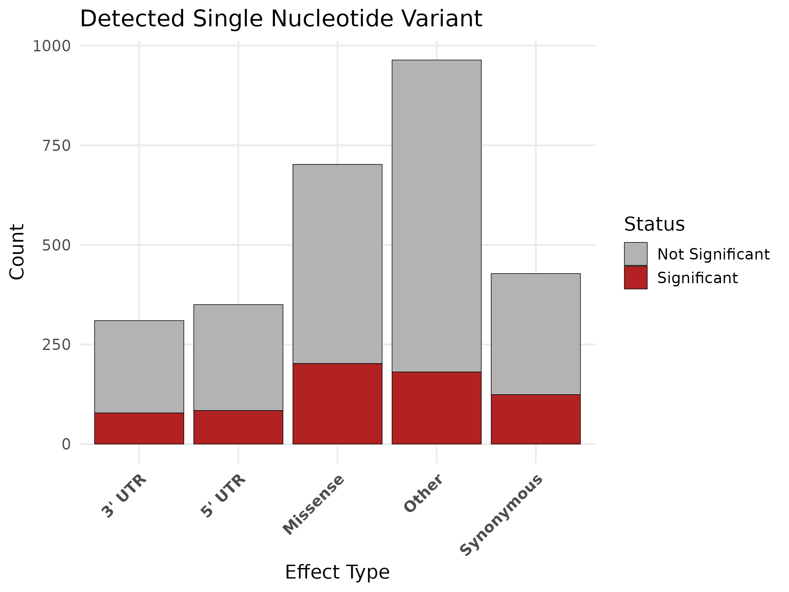

* **Barplot** summarizing significant versus non-significant variants:
  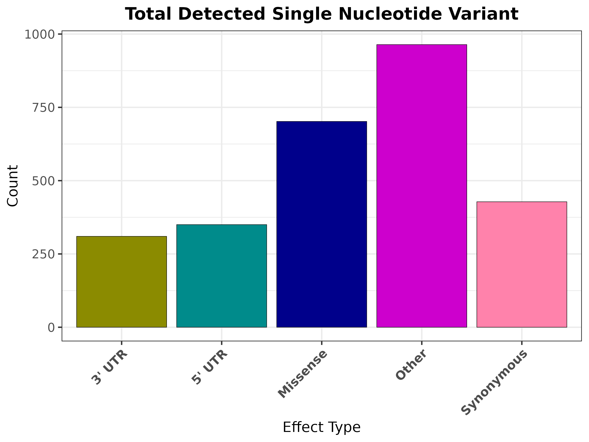

* **Volcano plot** for SNV variants:
  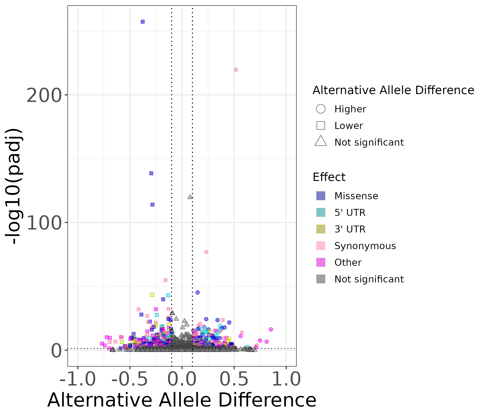

* **Circos plot** integrating:
  1. Five heatmaps showing allele frequency levels for distinct variant types.
  2. A track indicating the direction of alternative allele frequency changes (`Higher` / `Lower`).
  3. Internal links connecting common variants within the same gene (`Gene_ID`).
  


## CircRNA analysis

The results/ciri2 directory contains output files from the circRNA detection process. Since this analysis is highly specific, data interpretation should be tailored to each individual project. Each table was generated separately for each sample and has the following structure:

| circRNA_ID | chr | circRNA_start | circRNA_end | #junction_reads | SM_MS_SMS | #non_junction_reads | junction_reads_ratio | circRNA_type | gene_id | strand | junction_reads_ID |
| :--- | :--- | :--- | :--- | :--- | :--- | :--- | :--- | :--- | :--- | :--- | :--- |
| chr1:27131522\|27132831 | chr1 | 27131522 | 27132831 | 31 | 1_2_0 | 108 | 0.365 | exon | CL.2899, | - | A00553:235:H2C5GDSX7:1:2468:... |
| chr1:75034213\|75034420 | chr1 | 75034213 | 75034420 | 12 | 0_2_1 | 151 | 0.137 | exon | CL.7863, | - | A00553:235:H2C5GDSX7:1:2676:... |
| chr3:34781099\|34782742 | chr3 | 34781099 | 34782742 | 35 | 3_4_1 | 227 | 0.236 | exon | CL.18467, | + | A00553:235:H2C5GDSX7:1:2375:... |
| chr3:54772757\|54957565 | chr3 | 54772757 | 54957565 | 21 | 5_5_0 | 93 | 0.311 | exon | CL.20643, | + | A00553:235:H2C5GDSX7:1:2430:... |
| chr4:5639203\|5695678 | chr4 | 5639203 | 5695678 | 15 | 5_1_1 | 9102 | 0.003 | intergenic_region | n/a | - | A00553:235:H2C5GDSX7:1:1156:... |

## Citation

If you draw inspiration from the solutions I used in this pipeline, please feel free to cite me.

paper in preparation